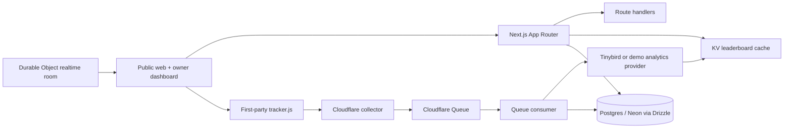

# SurgeIndex

SurgeIndex is a production-minded MVP for discovering websites that are gaining attention. The public experience is a warm, fast directory with live-style rankings, breakout signals, explainable Heat Scores, source-aware metrics, claim flow, referral tracking, and a clearly separated sponsored distribution lane.

The repository is intentionally runnable in `DEMO_MODE=true`: the public app has deterministic fictional sites so the product can be reviewed without database, GA4, Tinybird, Stripe, or Cloudflare credentials. The production seams are present in the schema, analytics provider interfaces, tracker, workers, route handlers, and deployment configuration, but the demo UI does not pretend those external systems are connected.

## Quick start

Requirements: Node.js 20.9+, pnpm 11, and Docker only if you want local Postgres.

```bash
pnpm install
cp .env.example apps/web/.env
pnpm dev
```

Open [http://localhost:3000](http://localhost:3000). Demo mode is enabled in the example environment. No database is required for the public review flow.

Useful commands:

```bash
pnpm typecheck       # all workspace packages
pnpm lint            # Next/React lint
pnpm test            # Vitest unit and contract tests
pnpm test:e2e        # Playwright Chromium flow tests; starts port 3100
pnpm build           # tracker bundle, then Next production build
pnpm start           # serve the Next production build
pnpm db:up           # optional local Postgres
pnpm tracker:build   # rebuild apps/web/public/tracker.js
pnpm preview         # OpenNext Cloudflare preview; requires adapter setup
pnpm deploy          # OpenNext Cloudflare deploy; requires Cloudflare auth
```

The root `pnpm build` also copies the minified first-party tracker to `apps/web/public/tracker.js`.

## Product surface

The public experience includes:

- Homepage with a live-style hero chart, query/category filters, Live/24H/7D/Breakouts/New tabs, ranked cards, source badges, and activity strip.
- `/rankings`, `/breakouts`, `/categories`, `/categories/[slug]`, `/search`, and `/site/[slug]` directory surfaces.
- Site profiles with Heat Score breakdown, rank history, attention chart, referral count, verification state, related sites, and a secure `/go/[siteSlug]` referral redirect.
- `/submit` domain validation and waitlist-ready submission flow, plus ownership verification architecture at `/claim/[siteId]`.
- `/methodology`, `/pricing`, `/boost`, `/creators`, `/campaigns`, `/privacy`, `/terms`, and a custom not-found page.
- Demo owner workspace at `/dashboard`, with sites, analytics, verification, badge, boosts, billing, and settings surfaces.
- Demo admin review queue at `/admin`.
- JSON endpoints for leaderboard, categories, activity, search, site detail, time series, site submission, event collection, and SVG badges.

## Architecture



The package boundaries are:

- `packages/shared`: types, URL/domain safety, formatting, source labels, and shared utilities.
- `packages/scoring`: deterministic Heat Score v1, small-base protection, explainable breakdowns, and rank comparator.
- `packages/anti-fraud`: tracker event and outbound click validation, replay/heartbeat checks, and fraud penalties.
- `packages/analytics`: provider interface plus deterministic demo provider and Tinybird adapter.
- `packages/db`: Drizzle schema covering identity, sites, claims, verification, metrics, rank snapshots, boosts, payments, fraud flags, moderation, and tracker events.
- `tracker`: consent-aware first-party tracker bundle with batching, retry, visibility/pageview/engagement events, and an opaque installation key.
- `workers/collector`, `workers/queue-consumer`, `workers/realtime`: Cloudflare Worker seams for ingestion, asynchronous processing, and live fan-out.

## Truth and trust rules

Every metric in the review experience carries a source label. Fictional values are labeled `Demo Data`; connected-source labels are reserved for real tracker or GA4 measurements. The public cards distinguish traffic from SurgeIndex referrals, and the boost experience explicitly states that paid placement never changes organic rank or Heat Score.

The score is versioned as `v1` and is based on growth velocity, live acceleration, traffic volume, engagement quality, and trust/confidence. Small sites receive a conservative base-size treatment. Fraud decisions are separated from raw collection so suspicious events can be quarantined without rewriting the underlying event record.

Outbound links pass through `/go/[siteSlug]`, which only redirects to an allowlisted `http`/`https` destination and sends `Cache-Control: no-store` plus a referral header in demo mode. Navigation links disable prefetch for this route so a browser does not follow an external redirect merely while rendering a card.

## Environment and deployment

Copy `.env.example` to `apps/web/.env`. Only `DEMO_MODE`, `NEXT_PUBLIC_APP_NAME`, and `NEXT_PUBLIC_APP_URL` are needed for the public local demo. Production requires a database URL, Better Auth secret, tracker signing/hash secrets, and the relevant GA4, Tinybird, Stripe, Turnstile, and Cloudflare credentials.

`apps/web/wrangler.jsonc` is the OpenNext deployment skeleton. Replace the KV namespace placeholder and create the `surgeindex-events` queue before using `pnpm preview` or `pnpm deploy`. The collector, queue consumer, and realtime worker each have their own Wrangler config under `workers/`.

Auth, payment, GA4, Tinybird, Turnstile, and Cloudflare integrations are intentionally demo-safe until credentials and production policy are supplied. The UI labels those states instead of presenting simulated records as live business data.

## Review evidence

The implementation handoff is in [BUILD_REPORT.md](BUILD_REPORT.md). It records the validation commands, browser flows, known integration limits, and screenshot evidence under `output/playwright/`.
