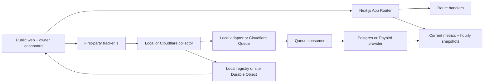

# SurgeIndex

SurgeIndex is a production-minded MVP for discovering websites that are gaining attention. The public experience is a warm, fast directory with live-style rankings, breakout signals, explainable Heat Scores, source-aware metrics, claim flow, referral tracking, and a clearly separated sponsored distribution lane.

The repository is intentionally runnable in `APP_MODE=demo` with `DATA_PROVIDER=demo`: the public app has deterministic fictional sites so the product can be reviewed without database, GA4, Tinybird, Stripe, or Cloudflare credentials. The production path requires `APP_MODE=production`, `DATA_PROVIDER=postgres`, a database, and a Better Auth secret. There is no silent fallback between modes or providers.

## Quick start

Requirements: Node.js 20.9+, pnpm 11, and Docker only if you want local Postgres.

```bash
pnpm install
cp .env.example apps/web/.env
pnpm dev
```

Open [http://localhost:3000](http://localhost:3000). Demo mode is enabled in the example environment. No database is required for the public review flow.

Useful commands:

```bash
pnpm typecheck       # all workspace packages
pnpm lint            # Next/React lint
pnpm test            # Vitest unit and contract tests
pnpm test:e2e        # Playwright Chromium flow tests; starts port 3100
pnpm build           # tracker bundle, then Next production build
pnpm start           # serve the Next production build
pnpm db:up           # optional local Postgres
pnpm tracker:build   # rebuild apps/web/public/tracker.js
pnpm traffic:load    # bounded local/staging collector correctness probe
pnpm ga4:fixture     # deterministic read-only GA4 provider smoke test
pnpm ga4:sync        # production Postgres Core sync; demo mode exits disabled
pnpm ga4:realtime    # production Postgres Realtime sync; demo mode exits disabled
pnpm ga4:backfill    # production Postgres bounded backfill; demo mode exits disabled
pnpm ga4:health      # production Postgres GA4 operations view; demo mode exits disabled
pnpm boost:fixture   # deterministic Boost delivery/reporting fixture; never charges
pnpm boost:forecast  # production inventory forecast; demo mode exits disabled
pnpm boost:pace      # idempotent pacing job seam; demo mode exits disabled
pnpm boost:aggregate # rebuild persisted delivery aggregates; demo mode exits disabled
pnpm boost:reconcile-payments # inspect pending application payment ledger rows
pnpm boost:release-reservations # release expired Checkout inventory holds
pnpm stripe:test-webhook # local signed Stripe fixture only; no network or charge
pnpm preview         # OpenNext Cloudflare preview; requires adapter setup
pnpm deploy          # OpenNext Cloudflare deploy; requires Cloudflare auth
```

The root `pnpm build` also copies the minified first-party tracker to `apps/web/public/tracker.js`.

## Product surface

The public experience includes:

- Homepage with a live-style hero chart, query/category filters, Live/24H/7D/Breakouts/New tabs, ranked cards, source badges, and activity strip.
- `/rankings`, `/breakouts`, `/categories`, `/categories/[slug]`, `/search`, and `/site/[slug]` directory surfaces.
- Site profiles with Heat Score breakdown, rank history, attention chart, referral count, verification state, related sites, and a secure `/go/[siteSlug]` referral redirect.
- `/live` and `/api/live/[siteId]` report accepted tracker active visitors/sessions with local or explicitly configured Durable Object realtime.
- `/submit` domain validation and waitlist-ready submission flow, plus ownership verification architecture at `/claim/[siteId]`.
- `/methodology`, `/pricing`, `/boost`, `/creators`, `/campaigns`, `/privacy`, `/terms`, and a custom not-found page.
- Demo owner workspace at `/dashboard`, with sites, analytics, verification, badge, boosts, billing, and settings surfaces.
- Production owner tracker installation and analytics at `/dashboard/sites/[siteId]/verification` and `/dashboard/sites/[siteId]/analytics`.
- Development-only real tracker fixture at `/dev/tracker-fixture` and aggregate operational summary at `/admin/traffic`.
- Demo admin review queue at `/admin`.
- JSON endpoints for leaderboard, categories, activity, search, site detail, time series, site submission, event collection, and SVG badges.

## Architecture



The package boundaries are:

- `packages/shared`: types, URL/domain safety, formatting, source labels, and shared utilities.
- `packages/scoring`: deterministic Heat Score v1, small-base protection, explainable breakdowns, and rank comparator.
- `packages/anti-fraud`: tracker event and outbound click validation, replay/heartbeat checks, and fraud penalties.
- `packages/analytics`: shared event-store/provider interfaces, deterministic demo provider, Postgres event store, and Tinybird adapter.
- `packages/ga4`: normalized read-only Google Analytics 4 OAuth/provider contracts, deterministic fixture provider, domain matching, report normalization, and retry helpers.
- `packages/db`: Drizzle schema covering identity, sites, claims, verification, current/snapshot traffic metrics, tracker keys/events, attribution, ingestion failures, active sessions, ranks, boosts, payments, fraud flags, and moderation.
- `tracker`: consent-aware first-party tracker bundle with one-time initialization, SPA navigation, visibility/engagement, retry, attribution cleanup, and measured bundle output.
- `workers/collector`, `workers/queue-consumer`, `workers/realtime`, `workers/aggregation`: Cloudflare Worker implementations for ingestion, asynchronous processing, site-level live fan-out, and scheduled aggregation.

## Truth and trust rules

Every metric in the review experience carries a source label. Fictional values are labeled `Demo Data`; connected-source labels are reserved for real tracker or GA4 measurements. The public cards distinguish traffic from SurgeIndex referrals, and the boost experience explicitly states that paid placement never changes organic rank or Heat Score.

The score is versioned as `v1` and is based on growth velocity, live acceleration, traffic volume, engagement quality, and trust/confidence. Small sites receive a conservative base-size treatment. Fraud decisions are separated from raw collection so suspicious events can be quarantined without rewriting the underlying event record.

Outbound links pass through `/go/[siteSlug]`, which only redirects to an allowlisted `http`/`https` destination and sends `Cache-Control: no-store` plus a referral header in demo mode. Navigation links disable prefetch for this route so a browser does not follow an external redirect merely while rendering a card.

## Environment and deployment

Copy `.env.example` to `apps/web/.env`. `APP_MODE` and `DATA_PROVIDER` are always required. The public local demo uses `APP_MODE=demo` and `DATA_PROVIDER=demo`. Production requires `APP_MODE=production`, `DATA_PROVIDER=postgres`, a database URL, a Better Auth secret, tracker signing/hash/rotation secrets when enabled, and the credentials/bindings for the explicitly selected analytics, queue, and realtime providers. See [docs/OPERATIONS_TRACKER_PIPELINE.md](docs/OPERATIONS_TRACKER_PIPELINE.md) for the provider matrix.

`apps/web/wrangler.jsonc` is the OpenNext deployment skeleton. Replace the KV namespace placeholder and create the `surgeindex-events` queue before using `pnpm preview` or `pnpm deploy`. The collector, queue consumer, and realtime worker each have their own Wrangler config under `workers/`.

The first administrator is promoted out-of-band after sign-up: `ADMIN_BOOTSTRAP_CONFIRM=<exact-email> pnpm admin:promote -- <exact-email>`. The command refuses to promote a second account unless `ADMIN_BOOTSTRAP_ALLOW_EXISTING=true` is set explicitly; there is no public role-changing endpoint.

Auth, payment, GA4, Tinybird, Turnstile, and Cloudflare integrations are intentionally demo-safe until credentials and production policy are supplied. The UI labels those states instead of presenting simulated records as live business data.

Batch 5 GA4 implementation details are documented in [BATCH_5_REPORT.md](BATCH_5_REPORT.md), [OAuth](docs/GA4_OAUTH.md), [property selection](docs/GA4_PROPERTY_SELECTION.md), [metric definitions](docs/GA4_METRIC_DEFINITIONS.md), [sync architecture](docs/GA4_SYNC_ARCHITECTURE.md), [quota management](docs/GA4_QUOTA_MANAGEMENT.md), [source reconciliation](docs/GA4_SOURCE_RECONCILIATION.md), [token security](docs/GA4_TOKEN_SECURITY.md), and [operations](docs/GA4_OPERATIONS.md). Real Google credential verification remains an explicit prerequisite for external launch claims. Register one exact `GA4_OAUTH_REDIRECT_URI` per environment at `/api/ga4/callback`; Google does not support wildcard redirect URIs.

Batch 6 Boost/Stripe implementation details are documented in [BATCH_6_REPORT.md](BATCH_6_REPORT.md), [product rules](docs/BOOST_PRODUCT_RULES.md), [inventory](docs/BOOST_INVENTORY.md), [state machine](docs/BOOST_CAMPAIGN_STATE_MACHINE.md), [ad serving](docs/BOOST_AD_SERVING.md), [impression measurement](docs/BOOST_IMPRESSION_MEASUREMENT.md), [attribution](docs/BOOST_ATTRIBUTION.md), [reporting](docs/BOOST_REPORTING.md), [Stripe Checkout](docs/STRIPE_CHECKOUT.md), [Stripe webhooks](docs/STRIPE_WEBHOOKS.md), [refunds and underdelivery](docs/BOOST_REFUNDS_AND_UNDERDELIVERY.md), and [operations](docs/BOOST_OPERATIONS.md). Stripe test-mode verification remains pending until a real test Checkout and signed webhook are exercised.

## Batch 3 traffic pipeline

The first-party traffic implementation is documented in [BATCH_3_REPORT.md](BATCH_3_REPORT.md). Operational and privacy details are split into [tracker installation](docs/TRACKER_INSTALLATION.md), [event schema](docs/TRACKER_EVENT_SCHEMA.md), [metric definitions](docs/TRAFFIC_METRIC_DEFINITIONS.md), [privacy data flow](docs/PRIVACY_DATA_FLOW.md), [realtime architecture](docs/REALTIME_ARCHITECTURE.md), [referral attribution](docs/REFERRAL_ATTRIBUTION.md), and [operations](docs/OPERATIONS_TRACKER_PIPELINE.md).

No Tinybird, Cloudflare Queue, Durable Object, or staging deployment is claimed unless real credentials and bindings are supplied and the corresponding preview/read-back checks are run.

## Review evidence

The implementation handoff is in [BUILD_REPORT.md](BUILD_REPORT.md). It records the validation commands, browser flows, known integration limits, and screenshot evidence under `output/playwright/`.
